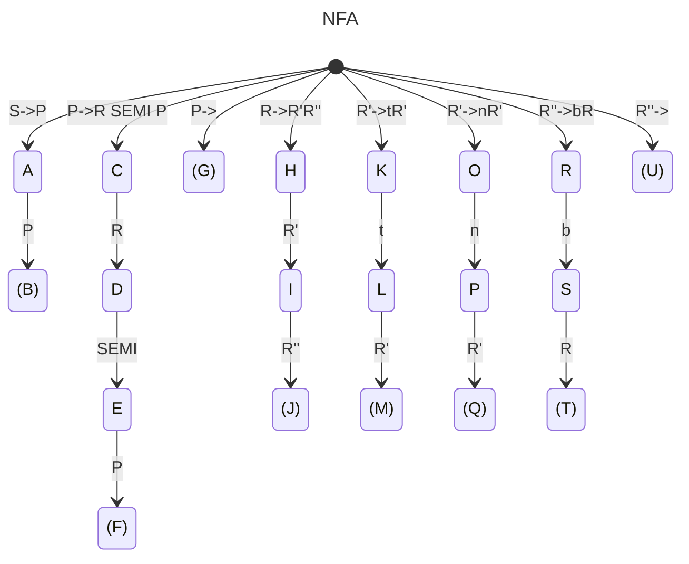
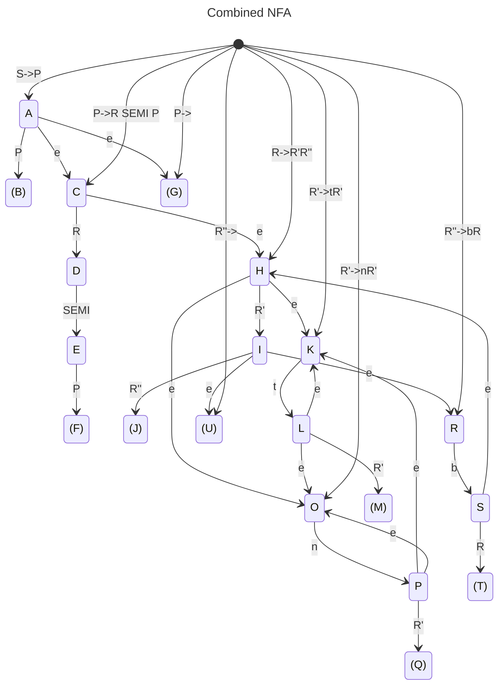

$P\rightarrow R;P\ |$ \
$R \rightarrow R' R''$\
$R' \rightarrow t R'\ |\ nR'\ |$ \
$R'' \rightarrow bR\ |$

add additional

$S\rightarrow P$

*Yes the below NFAs skip N. I forgot*

```mermaid
---
title: NFA
---
stateDiagram-v2
[*] --> A : S->P
A --> (B) : P

[*] --> C : P->R SEMI P
C --> D : R
D --> E : SEMI
E --> (F) : P

[*] --> (G) : P->

[*] --> H : R->R'R''
H --> I : R'
I --> (J) : R''

[*] --> K : R'->tR'
K --> L : t
L --> (M) : R'

[*] --> O : R'->nR'
O --> P : n
P --> (Q) : R'

[*] --> R : R''->bR
R --> S : b
S --> (T) : R

[*] --> (U) : R''->
```

```mermaid
---
title: Combined NFA
---
stateDiagram-v2
[*] --> A : S->P
A --> (B) : P
A --> C : e
A --> (G) : e

[*] --> C : P->R SEMI P
C --> D : R
C --> H : e
D --> E : SEMI
E --> (F) : P

[*] --> (G) : P->

[*] --> H : R->R'R''
H --> I : R'
H --> K : e
H --> O : e
I --> (J) : R''
I --> R : e
I --> (U) : e

[*] --> K : R'->tR'
K --> L : t
L --> (M) : R'
L --> K : e
L --> O : e

[*] --> O : R'->nR'
O --> P : n
P --> (Q) : R'
P --> K : e
P --> O : e

[*] --> R : R''->bR
R --> S : b
S --> (T) : R
S --> H : e

[*] --> (U) : R''->
```
