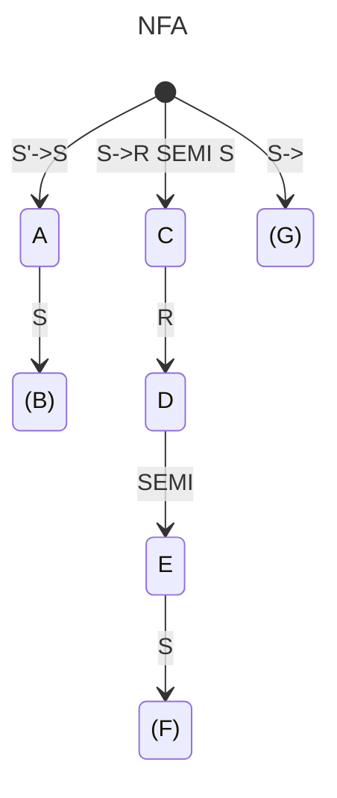
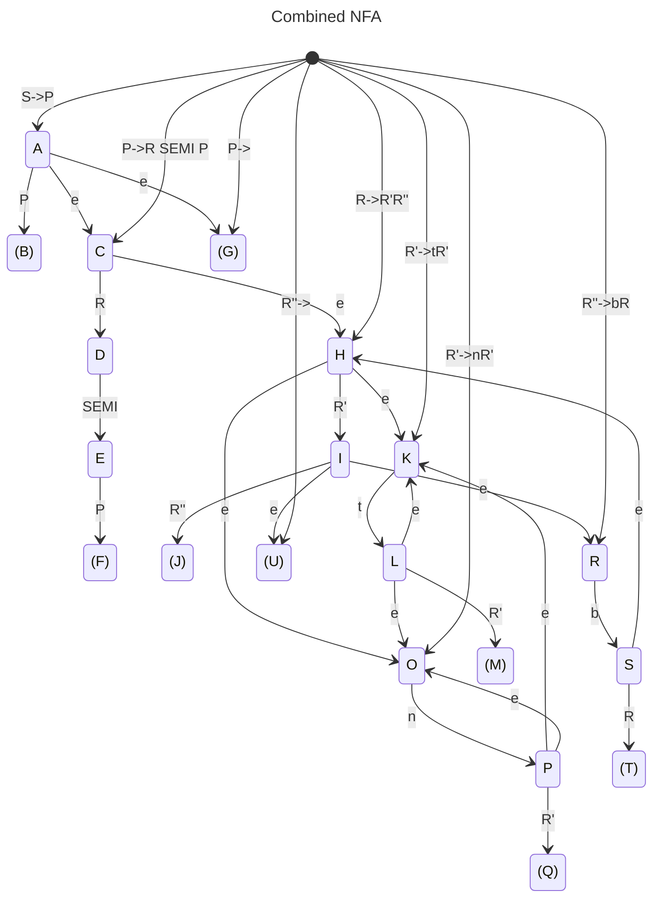

# Internal Parsing

$S\rightarrow R;S\ |$ \
$R\rightarrow n:R'\ |\ t:p$\
$R' \rightarrow R'' R'''$\
$R'' \rightarrow t R''\ |\ nR''\ |$ \
$R''' \rightarrow bR'\ |$

## Table-driven LL(1)
*If this is enough, ignore SLR*

|| Nullable | First | Follow |
|-|-|-|-|
|S|y|${n,t}$|$Ø$|
|R|n|${n,t}$|$\{;\}$|
|R'|y|${n,t,b}$|$\{;\}$|
|R''|y|${n,t}$|$\{b,;\}$|
|R'''|y|${b}$|$\{;\}$|

Nullable

|Rule \ Iteration| 1|2|3|4|
|-|-|-|-|-|
|$S$|n|y|y|y|
|$R$|n|n|n|n|
|$R'$|n|n|y|y|
|$R''$|n|y|y|y|
|$R'''$|n|y|y|y|

Follow

$S'\rightarrow S\$$

|Rule \ Iteration | 1 | 2 |
|-|-|-|
|$S$|$Ø$|$Ø$|
|$R$|$\{;\}$|$\{;\}$|
|$R'$|$Ø$|$\{;\}$|
|$R''$|$\{b\}$|$\{b,;\}$|
|$R'''$|$Ø$|$\{;\}$|

## SLR

add additional

$S'\rightarrow S$

*Yes the below NFAs skip N. I forgot*

